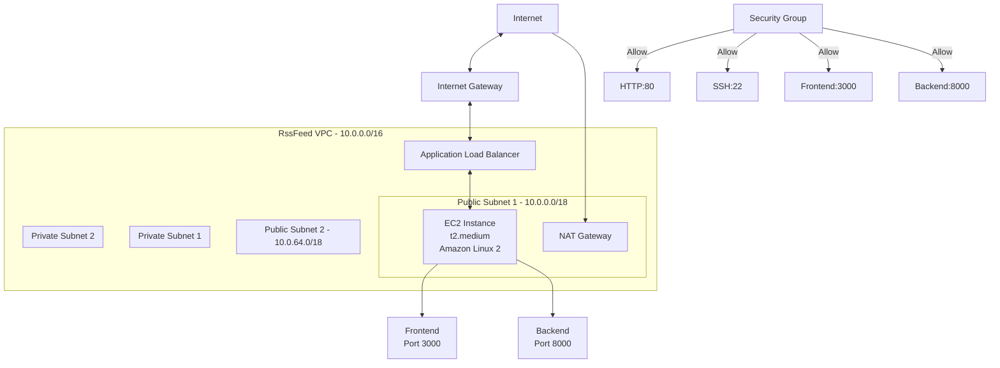
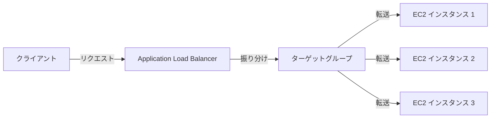

## ネットワーク構成

```mermaid
graph TB
    subgraph VPC[RssFeed VPC - 10.0.0.0/16]
        subgraph PublicSubnet1[Public Subnet 1 - 10.0.0.0/18]
            EC2[EC2 Instance<br>t2.medium<br>Amazon Linux 2]
            NAT[NAT Gateway]
        end
        
        subgraph PublicSubnet2[Public Subnet 2 - 10.0.64.0/18]
        end
        
        subgraph PrivateSubnet1[Private Subnet 1]
        end
        
        subgraph PrivateSubnet2[Private Subnet 2]
        end
        
        ALB[Application Load Balancer]
    end
    
    Internet[Internet]
    IGW[Internet Gateway]
    
    %% 接続関係
    Internet <--> IGW
    IGW <--> ALB
    ALB <--> EC2
    Internet --> NAT
    
    %% EC2のポート
    Frontend[Frontend<br>Port 3000]
    Backend[Backend<br>Port 8000]
    EC2 --> Frontend
    EC2 --> Backend
    
    %% セキュリティグループ
    SG[Security Group]
    SG -->|Allow| HTTP:80
    SG -->|Allow| SSH:22
    SG -->|Allow| Frontend:3000
    SG -->|Allow| Backend:8000
```

## ターゲティング

```mermaid

graph LR
    Client[クライアント]
    ALB[Application Load Balancer]
    TG[ターゲットグループ]
    EC2_1[EC2 インスタンス 1]
    EC2_2[EC2 インスタンス 2]
    EC2_3[EC2 インスタンス 3]

    Client -->|リクエスト| ALB
    ALB -->|振り分け| TG
    TG -->|転送| EC2_1
    TG -->|転送| EC2_2
    TG -->|転送| EC2_3
```
