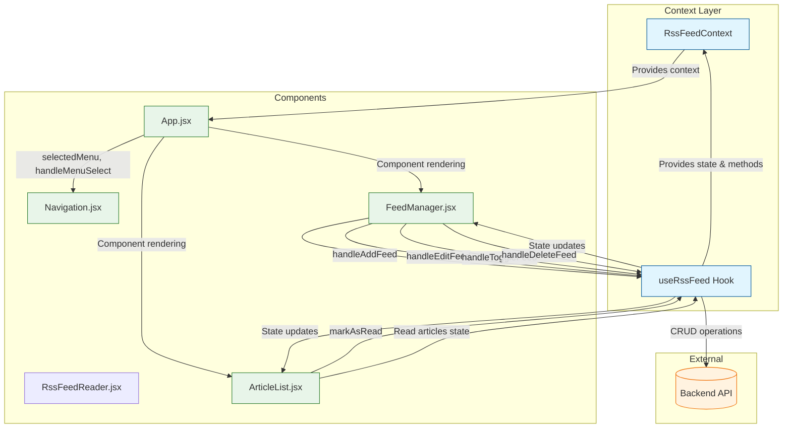

```mermaid
graph TD
    subgraph Context Layer
        RssFeedContext[RssFeedContext]
        useRssFeed[useRssFeed Hook]
    end

    subgraph Components
        App[App.jsx]
        RssFeedReader[RssFeedReader.jsx]
        Navigation[Navigation.jsx]
        FeedManager[FeedManager.jsx]
        ArticleList[ArticleList.jsx]
    end

    subgraph External
        BackendAPI[(Backend API)]
    end

    %% Context and Hook relationships
    useRssFeed -->|Provides state & methods| RssFeedContext
    RssFeedContext -->|Provides context| App

    %% Component hierarchy and props flow
    App -->|selectedMenu, handleMenuSelect| Navigation
    App -->|Component rendering| FeedManager
    App -->|Component rendering| ArticleList

    %% State management flow
    useRssFeed -->|CRUD operations| BackendAPI
    useRssFeed -->|State updates| FeedManager
    useRssFeed -->|State updates| ArticleList

    %% Data flow for FeedManager
    FeedManager -->|handleAddFeed| useRssFeed
    FeedManager -->|handleEditFeed| useRssFeed
    FeedManager -->|handleToggleFeed| useRssFeed
    FeedManager -->|handleDeleteFeed| useRssFeed

    %% Data flow for ArticleList
    ArticleList -->|markAsRead| useRssFeed
    ArticleList -->|Read articles state| useRssFeed

    classDef contextLayer fill:#e1f5fe,stroke:#01579b
    classDef component fill:#e8f5e9,stroke:#2e7d32
    classDef external fill:#fff3e0,stroke:#ef6c00

    class RssFeedContext,useRssFeed contextLayer
    class App,Navigation,FeedManager,ArticleList component
    class BackendAPI external
```
