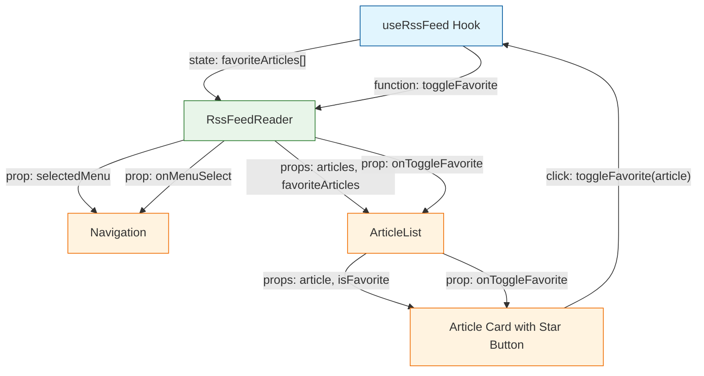

# React + Vite

This template provides a minimal setup to get React working in Vite with HMR and some ESLint rules.

Currently, two official plugins are available:

- [@vitejs/plugin-react](https://github.com/vitejs/vite-plugin-react/blob/main/packages/plugin-react/README.md) uses [Babel](https://babeljs.io/) for Fast Refresh
- [@vitejs/plugin-react-swc](https://github.com/vitejs/vite-plugin-react-swc) uses [SWC](https://swc.rs/) for Fast Refresh

# 状態管理について 例：お気に入り記事
1. ユーザーがお気に入りボタンをクリック
2. toggleFavorite関数が呼び出される
3. APIリクエストが実行される
4. 状態が更新される（setFavoriteArticles）
5. 更新された状態が関連コンポーネントに反映される

