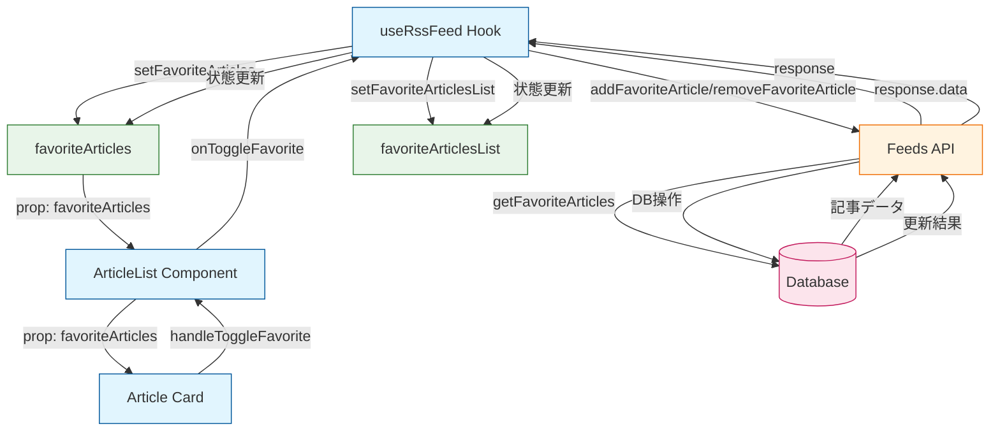
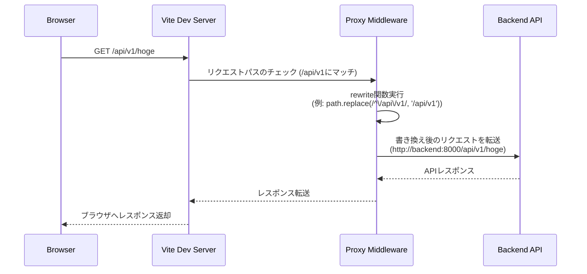
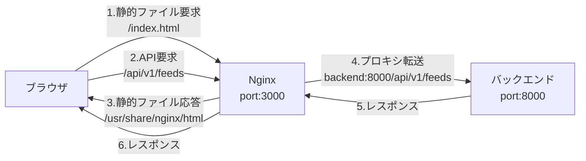

# React + Vite

This template provides a minimal setup to get React working in Vite with HMR and some ESLint rules.

Currently, two official plugins are available:

- [@vitejs/plugin-react](https://github.com/vitejs/vite-plugin-react/blob/main/packages/plugin-react/README.md) uses [Babel](https://babeljs.io/) for Fast Refresh
- [@vitejs/plugin-react-swc](https://github.com/vitejs/vite-plugin-react-swc) uses [SWC](https://swc.rs/) for Fast Refresh

# 状態管理
## お気に入り記事
1. 初期ロード時にAPIからお気に入り記事を取得
2. ユーザーのお気に入りボタンクリックでtoggleFavorite関数が実行
3. APIを通じてデータベースが更新
4. 更新結果を元に状態（favoriteArticles, favoriteArticlesList）を更新
5. 更新された状態がUIに反映

# ルーティング
## 開発環境

## 本番環境

